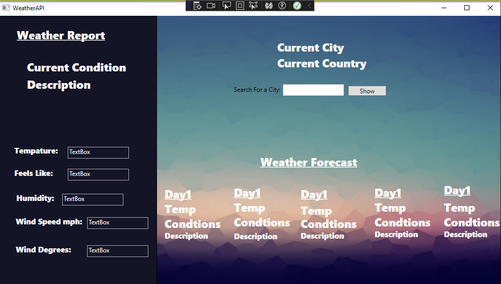
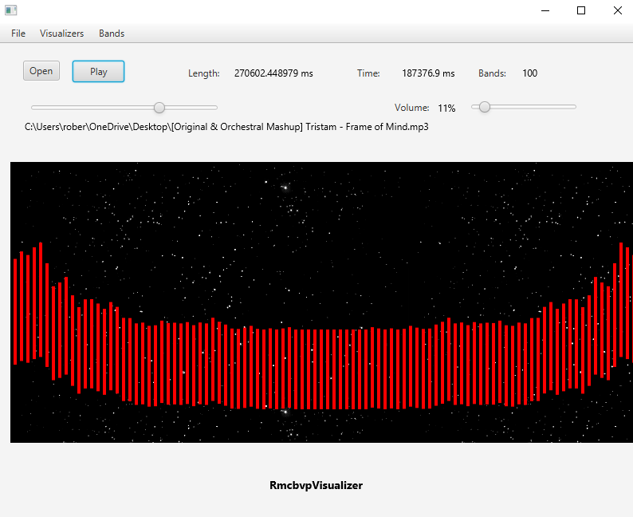

# Game Developer

### Technical Skills: 

- Programming/Languages: C, C#, Java ,Swift  

- Database Management: SQL, MySQL, MongoDB 

- Web development: HTML, CSS, Basic understanding of JavaScript/Typescript, Angular, Node, and React  

 - Cloud Services: AWS  

- Systems: Windows server 2019, VMware Workstation 14, Linux- CentOS, Mac OS X 

- Version Control: Experienced with Perforce and GitHub  

## Education 
**Bachelor of Science in Information Technology | University of Missouri, Columbia 
December 2022**

Relevant Coursework: Algorithm Design and Programming I & II, Database Applications and Information Systems, 
Fundamentals of Network Technology, Cyber Security, Topics in Information Technology, Object-Oriented Programming, 
Project and Team Management, Principles of Management, C#/.NET Development, iOS App Development I, Computer 
System Administration, Web Application Development I & II  

## Experince 1
**Peer Learning Assistant | Introduction to Virtual Reality | University of Missouri (2021-2022)** 

- Provided comprehensive guidance and mentorship to a diverse group of over 20 students enrolled in a challenging 
Virtual Reality class, focusing on coursework and hands-on coding proficiency utilizing Unity and C#.

- Demonstrated commitment to professional development by actively strengthening personal code review and 
debugging skills through the rigorous evaluation and troubleshooting of student projects.

- Collaborated seamlessly with the course instructor, playing an integral role in the enhancement of overall learning 
experiences and the timely resolution of student concerns.

- Cultivated a positive and inclusive learning environment, fostering student engagement and success through 
encouragement and tailored support

## Experince 2
 **Game Developer | Adroit Studios (2021-2023)**

- Held a pivotal role in the innovation and successful execution of three game projects at Adroit Studios, skillfully 
managing a significant $2 million budget, thereby showcasing adept project management capabilities within the 
dynamic gaming industry. 

- Leveraged advanced Unity and C# scripting techniques to achieve outstanding results, notably delivering a remarkable 
25% improvement in overall game performance and an impressive 30% boost in user engagement. 

- Collaborated harmoniously with a cross-functional team of 15 professionals, resulting in a commendable 25% increase 
in overall team efficiency. 

- Spearheaded the implementation of Agile methodologies, leading to a substantial 15% reduction in post-release bug 
fixes and contributing significantly to a notable 20% decrease in development cycle time. 

# Project 1
**Hypnophobia**

Hypnophobia represents a significant milestone in my academic journey, serving as the capstone project for my college graduation. Collaborating with a team of three talented individuals, comprising 
two developers and two 3D modelers, we undertook the task of creating this project from scratch, encompassing various aspects, including textures, sounds, and visual elements.

[Download Hypnophobia](https://drive.google.com/file/d/1Q7MJWnuD_N_L0eWb5BKXBuy2nSm0hWnS/view?usp=sharing)
 

# Project 2
**Weather Application**

A simple weather forecast app that tells you a cities weather and 5 day forecast. Made in  C# as a way to learn APIS for my first time, I also used the Newton.Json Library to help me handle parsing and
use the JSON file data. I also have a different version I coded in Java as a pratice, if interested I can also send you a download to that version, or will eventually add it to this site.

[Download Weather Application](https://drive.google.com/file/d/1Uc7lQZ6kEZlun1EtZn3fLwaFRJX9zG1f/view?usp=drive_link)

# Project 3
**Prosocial**

One of the biggest games Ive gotten to work on so far in my proffesional carrer. vSchool boasted a $2 million budget, and was created as an education assesment styled game.
Some of the work I did on the game includes setting up the gym scene in the game. This included using timelines, interfaces, scriptables objects delegates, events, and collections. I also
updated the games input system to unitys new input system, and desinged player movement and basic gameplay mechanics.

 

[Play/Download vSchool](https://adroitmu.itch.io/vschool)

# Project 4
**Audio Vizualizor**

A simple audio vizualizor project i did in Java,it marked a milestone in my development career as  first time using MVC. Just upload a song and watch it be visualized! Also change up the settings to
change how many bands there are,

[Download V](https://drive.google.com/file/d/1J4nXAdoCWjbXOtTgpXIIIafEMMDxeH45/view?usp=drive_link)
 
